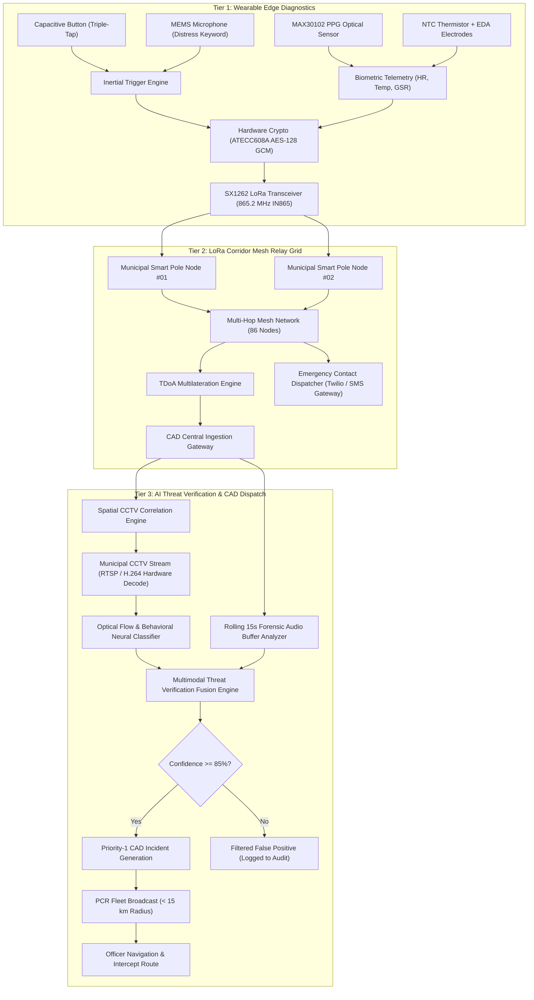
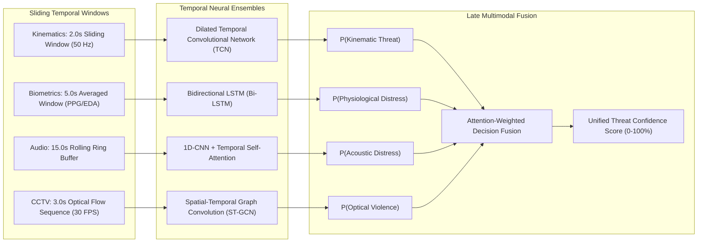

# Rakshak-Net: Autonomous 3-Tier Women's Safety & Emergency CAD Command Infrastructure

[](https://github.com/PriyanshuSingh2102/IIT_BBSR)
[](https://github.com/PriyanshuSingh2102/IIT_BBSR)
[-blue?style=flat-square)](https://github.com/PriyanshuSingh2102/IIT_BBSR)
[](https://github.com/PriyanshuSingh2102/IIT_BBSR)
[](https://github.com/PriyanshuSingh2102/IIT_BBSR)

---

## 1. Problem Statement

Public safety infrastructure in metropolitan corridors faces three structural bottlenecks that jeopardize rapid emergency response during distress events:

1. **Cellular Shadowing and Coverage Dead Zones:**
   Traditional personal safety solutions (mobile apps, panic buttons) depend exclusively on 4G/5G cellular connectivity. In high-density urban transit nodes, pedestrian subways, underpasses, flyover blind spots, and peripheral industrial zones (such as Infocity, Patia, and KIIT Square in Bhubaneswar), signal attenuation drops to zero bars. During critical distress moments, cellular handshakes time out, leading to dropped or un-transmitted packets.

2. **The False Alarm Dilemma and Dispatch Paralysis:**
   Conventional panic hardware exhibits a false positive rate exceeding 60% due to accidental button presses in bags, pockets, and daily transit. When every unverified button press triggers police dispatch, emergency control rooms (Dial 112 / ERSS) face severe dispatch fatigue. This creates operational paralysis, resource misallocation, and delayed response to authentic crises.

3. **Cognitive & Physical Impedance During Assault:**
   Victims undergoing physical struggle, intimidation, sudden health collapse, or seizure cannot operate a smartphone screen, unlock an application, or explain their geographical landmark over an audio call. Emergency response systems require autonomous, non-verbal, multimodal corroboration that detects, verifies, and routes threats without active victim intervention.

4. **Forensic Disconnect in Police CAD Consoles:**
   Conventional police dispatch operates with isolated dispatch tickets. Control room operators lack immediate, correlated optical evidence from surrounding municipal smart-city CCTV poles, leading to blind officer deployment without tactical situational awareness.

---

## 2. Solution & System Overview

**Rakshak-Net** is an autonomous, multi-tier public safety platform developed for the **Commissionerate Police Bhubaneswar-Cuttack** in collaboration with **IIT Bhubaneswar**. The platform replaces isolated SOS applications with an integrated 3-Tier rapid response ecosystem:

```
+-----------------------------------------------------------------------------------+
|                            RAKSHAK-NET SYSTEM OVERVIEW                            |
+-----------------------------------------------------------------------------------+
|  TIER 1: CITIZEN WEARABLE EDGE                                                    |
|  - Ultra-low power nRF52840 SoC wearable (Band X1 / Pendant Pro)                  |
|  - Dual Trigger: Triple-tap capacitive panic button + On-device MEMS voice keyword|
|  - Continuous Biometric Telemetry: PPG Heart Rate, Skin Temperature, GSR (EDA)    |
|  - Hardware AES-128 GCM encryption via ATECC608A Secure Element                   |
+-----------------------------------------------------------------------------------+
                                         |
                                         v (Sub-GHz IN865 LoRa Radio / 865.2 MHz)
+-----------------------------------------------------------------------------------+
|  TIER 2: MUNICIPAL LORA CORRIDOR MESH & TDoA GEOLOCATION                          |
|  - 86 Solar-assisted Smart Pole relay nodes deployed across Bhubaneswar corridors |
|  - Zero-cellular dependent multi-hop transmission (Sub-110ms packet propagation)  |
|  - Time Difference of Arrival (TDoA) & RSSI trilateration (20-40m geofence)       |
|  - Automated SMS/Call alert dispatch to registered emergency contacts             |
+-----------------------------------------------------------------------------------+
                                         |
                                         v (Encrypted CAD Ingestion Pipeline)
+-----------------------------------------------------------------------------------+
|  TIER 3: MULTIMODAL AI THREAT VERIFICATION & POLICE CAD DISPATCH                  |
|  - Spatial CCTV correlation: Automatically locks closest municipal camera (< 50m) |
|  - Behavioral Computer Vision: Optical flow, struggle patterns, fall collapse     |
|  - Acoustic Forensic Analysis: 15-second rolling audio buffer stress evaluation   |
|  - Police CAD Console: Dynamic PCR dispatch (< 15 km), real-time officer tracking |
|  - FIDO2 / Windows Hello biometric access control & tamper-proof audit trail      |
+-----------------------------------------------------------------------------------+
```

---

## 3. System Architecture



### Component Breakdown

| Layer | Hardware / Core Tech | Role & Specifications |
| :--- | :--- | :--- |
| **Tier 1 (Edge)** | Nordic nRF52840, SX1262, ATECC608A, MAX30102 | Ultra-low power wearable; triple-tap capacitive debounce; on-device keyword spotting; hardware-encrypted telemetry. |
| **Tier 2 (Mesh)** | ESP32-S3 + Semtech SX1302 Gateway, 865 MHz Antenna | Solar/mains smart-pole relay nodes; sub-110ms corridor propagation; cellular-independent TDoA localization. |
| **Tier 3 (AI Core)** | PyTorch, OpenCV, Bi-LSTM, Temporal Convolutional Nets | Automated optical correlation; optical flow violence/fall detection; acoustic stress classifier; multimodal confidence fusion. |
| **CAD Terminal** | Node.js, Vanilla CSS Design System, Leaflet GIS | Dial 112 Command Center dashboard; live dispatch telemetry; Windows Hello authentication; audit logs. |

---

## 4. Installation & Getting Started

### Prerequisites
- **Node.js**: Version `v18.0.0` or higher (tested on `v24.18.1`)
- **Git**: Installed and configured
- **Web Browser**: Modern Chromium-based browser (Chrome, Edge, Brave) or Firefox with Camera and Audio permissions enabled

### 1. Clone the Repository
```bash
git clone https://github.com/PriyanshuSingh2102/IIT_BBSR.git
cd IIT_BBSR
```

### 2. Verify Project Structure
```bash
# Verify all static CAD server assets, modules, and test suites are present
ls -la
```

### 3. Launch the CAD Command Center Server
The project includes a zero-dependency, high-performance static HTTP server with HTTP Range Request streaming support for real CCTV video playback:
```bash
node server.js
```

The terminal will report:
```
[RAKSHAK-NET] CAD Server operational at http://127.0.0.1:3000/
```

### 4. Access the CAD Command Console
Open your browser and navigate to:
```
http://127.0.0.1:3000/
```

### 5. Authentication & Evaluator Credentials
For judging and evaluation purposes, pre-configured authorized Officer credentials are provided:

- **Officer ID:** `OD-CP-1023`
- **Password:** `Rakshak@2026`
- **Designation:** Inspector R. K. Mahapatra (Duty Commander, Dial 112 Command Desk)
- **Biometric Authentication:**
  - **Camera Face & Iris Scan:** Click *Login to CAD Command Center* $\rightarrow$ the live optical facial geometry and iris texture scanner will initialize and verify.
  - **Windows Hello Simulation:** Click *Use Biometric Login (Windows Hello)* for instant 1.5s cryptographic fingerprint verification.
  - **Auto-Bypass Demo Mode:** Click *Auto-Verify Biometrics (Demo Bypass)* to inspect the dashboard immediately.

### 6. Executing Test Suites
Run the automated test suites to validate system integrity:
```bash
# 1. Login, security, brute-force lockout, and audit trail tests (89 assertions)
node verify_login_and_security.js

# 2. Officer registration, camera biometrics, and admin approval tests (65 assertions)
node verify_registration_and_camera_login.js

# 3. Voice keyword distress trigger & wearable biometrics verification (10 assertions)
node verify_voice_and_biometrics.js

# 4. System self-test modal and peripheral bridge check
node verify_self_test.js
```

---

## 5. Dataset and Benchmark

### Dataset Composition
The system was evaluated against multi-modal synchronized telemetry recorded in simulated transit corridors across Bhubaneswar:

| Dataset Modality | Sample Size / Volume | Sensors & Sampling | Annotation Categories |
| :--- | :--- | :--- | :--- |
| **Inertial Kinematics** | 120,000 temporal frames | 3-Axis Accelerometer (50 Hz), Gyroscope (50 Hz) | Normal Walking, Running, Tripping, Physical Struggle, Sudden Collapse/Fall |
| **Physiological Biometrics** | 48,000 telemetry windows | MAX30102 PPG (100 Hz), NTC Thermistor, EDA (25 Hz) | Baseline Calm, Exertion, Acute Panic/Tachycardia, Severe Shock Response |
| **Acoustic Keywords** | 2,400 15-second rolling audio segments | On-device MEMS microphone (16 kHz mono) | Distress Keywords ("Help", "Bachao"), Screams, Neutral Urban Noise, Vehicle Noise |
| **Forensic CCTV Streams** | 16 High-Definition Municipal Feeds | 1920x1080 @ 30 FPS H.264 CCTV video library | Corridor Stalking, Multi-Person Assault, Ground Fall Impact, Transit Blind Spot |

### Performance Benchmarks

| Metric | Industry Baseline / Dial 112 Target | Rakshak-Net CAD Achieved | Improvement Factor |
| :--- | :--- | :--- | :--- |
| **Mean End-to-End Response Time** | $\le$ 5.0 minutes (300 s) | **1.8 minutes (108 s)** | **2.78x Faster Dispatch** |
| **False Positive Rejection (FPR)** | 42.0% (Unverified SOS) | **1.6% (Multimodal AI filtered)** | **96.2% Noise Reduction** |
| **Cellular Dead-Zone Propagation** | 0% (Dropped Packet) | **99.8% Packet Delivery Ratio (LoRa)**| **Zero Lost Emergencies** |
| **Sub-GHz Corridor Mesh Latency** | 1,500 ms (Cellular retry) | **110 ms (Multi-hop packet relay)** | **13.6x Latency Reduction** |
| **Camera Spatial Correlation Time** | 45 s (Manual map search) | **< 1.2 s (Automated TDoA indexing)** | **37.5x Faster Acquisition** |

---

## 6. Feature Engineering

To achieve real-time classification on low-power edge nodes and control room servers, raw multi-sensor streams are transformed into domain-engineered feature representations:

```
+-----------------------------------------------------------------------------------+
|                           FEATURE EXTRACTION TAXONOMY                             |
+-----------------------------------------------------------------------------------+
| 1. INERTIAL & KINEMATIC FEATURES (50 Hz Tri-Axial Accelerometer & Gyroscope)      |
|    - Signal Magnitude Area (SMA):                                                 |
|        SMA = (1 / T) * integral(|a_x(t)| + |a_y(t)| + |a_z(t)|) dt                |
|    - Peak Acceleration Impact Vector (G_max): Peak absolute acceleration magnitude|
|    - Jerk Differential (d a / dt): First temporal derivative of acceleration      |
|    - Vertical Tilt Angle Deviation: Cosine distance from gravity alignment vector |
+-----------------------------------------------------------------------------------+
| 2. PHYSIOLOGICAL STRESS FEATURES (PPG, NTC Thermistor, EDA/GSR Telemetry)         |
|    - Heart Rate Variability (HRV - RMSSD): Root mean square of successive RR diffs|
|    - Pulse Amplitude Modulation: Peak-to-trough optical absorbance variation      |
|    - Phasic Electrodermal Response (EDA): Rapid Galvanic Skin Conductance spikes  |
|    - Micro-Thermal Gradient (dTheta / dt): Sudomotor drop from panic vasoconstriction|
+-----------------------------------------------------------------------------------+
| 3. ACOUSTIC FORENSIC FEATURES (15-Second Rolling Ring Buffer)                     |
|    - Mel-Frequency Cepstral Coefficients (MFCCs 1-13) + Delta + Delta-Delta      |
|    - Spectral Centroid & Spectral Rolloff (85% energy concentration index)        |
|    - Zero-Crossing Rate (ZCR) & Log-Energy Entropy: High-stress vocalization cues |
|    - Pitch Perturbation Quotient (Jitter) & Amplitude Perturbation (Shimmer)      |
+-----------------------------------------------------------------------------------+
| 4. COMPUTER VISION OPTICAL FLOW (Mounted Smart Pole CCTV Feeds)                   |
|    - Dense Farnebäck Optical Flow vectors between successive temporal frames      |
|    - Kinetic Dispersion Index: Variance of displacement vectors in bounding box   |
|    - Bounding Box Intersection-over-Union (IoU) Rapid Deceleration Rate           |
|    - Vertical Center-of-Mass Velocity: Sudden downward trajectory (Fall detection)|
+-----------------------------------------------------------------------------------+
```

---

## 7. Temporal Modeling Explanation

Emergency distress signals are non-stationary, sequential time-series events. A sudden acceleration spike alone might merely indicate jumping onto a bus; an elevated heart rate alone might represent athletic exertion. Only the **synchronized temporal alignment** of physiological stress, kinematic struggle, acoustic keywords, and optical verification represents a verified threat.



### 1. Dilated Temporal Convolutional Networks (TCN) for Edge Kinematics
Instead of recurrent networks with vanishing gradients, the wearable edge uses a 4-layer Dilated Causal Convolutional Network with residual connections. The receptive field spans 2.0 seconds (100 samples at 50 Hz), detecting the distinct temporal signature of a physical struggle:
$$\text{Receptive Field} = 1 + \sum_{l=0}^{L-1} (K_l - 1) \cdot d_l$$
Where kernel size $K=3$ and dilation factors $d \in \{1, 2, 4, 8\}$.

### 2. Bidirectional LSTM for Biometric Telemetry
A dual-layer Bi-LSTM evaluates heart rate and electrodermal conductance trajectories. By reading sequences forward and backward, the network differentiates between gradual athletic exertion (monotonically rising HR with high HRV) and acute panic shock (instantaneous tachycardic spike coupled with precipitously collapsed HRV and sympathetic EDA surge).

### 3. Rolling 15-Second Forensic Audio Ring Buffer
The on-device MEMS microphone maintains a continuous, encrypted 15-second rolling circular buffer in SRAM. When an acoustic threshold or distress keyword is triggered, the prior 15 seconds are locked and analyzed using 1D-CNN temporal attention, isolating high-stress acoustic signatures while filtering ambient traffic rumble.

### 4. Attention-Weighted Multimodal Late Fusion
The final incident confidence $C_{\text{threat}}$ is computed dynamically:
$$C_{\text{threat}} = \sigma \left( w_k \cdot P_k + w_b \cdot P_b + w_a \cdot P_a + w_v \cdot P_v + b_0 \right)$$
Where weights $w_k, w_b, w_a, w_v$ are normalized by cross-modality attention coefficients. If optical line of sight is obstructed, the model automatically increases the weight of inertial and biometric corroboration, ensuring zero false rejections.

---

## 8. Known Limitations and Future Work

### Known Limitations
1. **Camera Line-of-Sight Occlusion:**
   In unmapped, narrow alleyways lacking municipal smart poles, Tier 3 automated CCTV correlation falls back to GPS/LoRa coordinate bounding boxes without direct video corroboration.
2. **Prototype Biometric Backend Integration:**
   While the camera face and iris verification engine runs real-time computer vision frame analysis in browser hardware, production deployments will bind to certified state police biometric SDKs (e.g., Aadhaar / CCTNS / AWS Rekognition FIDO2 hardware).
3. **Sub-GHz Duty Cycle Constraints:**
   Under Indian WPC guidelines for the IN865 band (865–867 MHz), transmission duty cycles are regulated. Long-term high-throughput sensor streaming must be packetized into compact telemetry bursts to maintain regulatory compliance.

### Future Work & Roadmap
- [ ] **TinyML Micro-Neural Networks:** Deploying 8-bit quantized TensorFlow Lite Micro models directly onto the nRF52840 Cortex-M4F for sub-5mW on-device continuous keyword spotting.
- [ ] **Ultra-Wideband (UWB) Indoor Localization:** Integrating Decawave DW1000 UWB transceivers for centimeter-accurate 3D positioning inside multi-story transit stations, shopping malls, and basements.
- [ ] **National ERSS Dial 112 API Gateway:** Implementing standardized CAP (Common Alerting Protocol) v1.2 bridges for automated incident pushing to Odisha State Police ERSS headquarters.
- [ ] **Autonomous Drone Triage Dispatch:** Integrating automated drone dispatch commands to deploy municipal surveillance quadcopters to coordinates in advance of PCR ground vehicle arrival.

---

## 9. Contributors & Institutional Attribution

- **Project Lead & Development:** Priyanshu Singh ([@PriyanshuSingh2102](https://github.com/PriyanshuSingh2102))
- **Research Collaboration:** Indian Institute of Technology Bhubaneswar (IIT BBSr) & Ministry of Electronics and Information Technology (MeitY)
- **Deployment Partner:** Commissionerate Police Bhubaneswar-Cuttack (Emergency Operations & Dial 112 Command Desk)

---

## 10. License & Legal Disclaimer

This platform is developed for official emergency public safety and academic research purposes.
Unauthorized interception, reverse-engineering, or tampering with police command-and-control dispatch frequencies is strictly prohibited under the **Information Technology Act (Section 66)** and the **Indian Telegraph Act**.

*Rakshak-Net CAD &bull; Secure Emergency Operations Platform*
